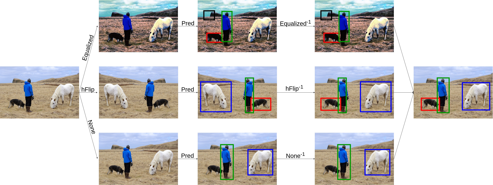

# LabelDetection

LabelDetection is a graphical tool that aims to facilitate all the steps required in the pipeline to construct and use a deep-learning base object detection model. This includes the functionality to annotate a dataset of images, train a model, and use it for prediction with new images. LabelDetection is based on the [LabelImg tool](https://github.com/tzutalin/labelImg), and its key features are:
- Facilitates the annotation of images.
- Detects objects using deep-learing based detection models trained with different algorithms and libraries. 
- Applies [Test time augmentation](https://github.com/ancasag/ensembleObjectDetection#test-time-augmentation-for-object-detection) to improve the performance of models.
- Generates the necessary code and folder structure to train a model using different algorithms. 
- Includes [data distillation](https://arxiv.org/abs/1712.04440) in the training code to employ unlabelled images to construct the detection model. 
- Generates a report of the detected objects. 


# Documentation


0. [Installation](#installation-and-requirements)
1. [Using detection models](#using-detection-models)
2. [Test-time augmentation for object detection](#test-time-augmentation-for-object-detection)
   * [Ensemble options](#ensemble-options)
   * [Techniques for TTA](#techniques-for-tta)
   * [Execution](#execution)
3. [Training new models](#training-new-models)
   * [Available models](#available-models)
   * [Downloading datasets to Colab](#downloading-datasets-to-colab)
   * [Data distillation](#data-distillation)
4. [Reports](#reports)
5. [Citation](#citation)
6. [Acknowledgements](#acknowledgements)


## Installation and Requirements

LabelDetection can be run on Linux. 


### Installation Linux:
This tool requires Python 3.6 and Qt5 and the packages listed in the ```requirements.txt``` file.

1. Clone this repository.

```bash
git clone https://github.com/ancasag/LabelDetection
```

2. Install the necessary dependencies.

```bash
cd LabelDetection
sudo apt-get install pyqt5-dev-tools
pip3 install -r requirements.txt
make qt5py3
```

3. Run LabelDetection:
```bash
python3 labelDetection.py
```
### Installation Windows:

Work in progress.

## Using detection models

LabelDetection can employ models trained with different algorithms and libraries to detect objects in the images. Currently, LabelDetection support algorithms trained with the following libraries:

- YOLO v3 models trained with the [Darknet library](https://pjreddie.com/darknet/yolo/). To use this kind of model, you need a folder with three files: a .weights file (that contains the weights of the model), a .cfg file (that contains the configuration of the network), and a .names file (that contains the classes that can be detected with the model). Files for [COCO dataset](http://cocodataset.org/): [download](https://unirioja-my.sharepoint.com/:u:/g/personal/joheras_unirioja_es/EZMfARcSSkVCjtTt6yZQTiQBM8-n8EcEb8NGx-gGO0erMg?e=hgL3WL).
- SSD512 models trained with the [MXNet library](https://gluon-cv.mxnet.io/model_zoo/detection.html). To use this kind of model, you need a folder with two files: a .params file (that contains the weights of the model), a .txt file (that contains the classes that can be detected with the model). Files for [COCO dataset](http://cocodataset.org/): [download](https://unirioja-my.sharepoint.com/:u:/g/personal/joheras_unirioja_es/EYKi21IZE1xMq0xOsRXNJsQByvUtV4M-TfKn-Rqdd4w8Lg?e=CNuKY6).
- Faster RCNN models trained with the [MXNet library](https://gluon-cv.mxnet.io/model_zoo/detection.html). To use this kind of model, you need a folder with two files: a .params file (that contains the weights of the model), a .txt file (that contains the classes that can be detected with the model).  Files for [COCO dataset](http://cocodataset.org/): [download](https://unirioja-my.sharepoint.com/:u:/g/personal/joheras_unirioja_es/EV88mWIvfeJIlDzS3JkL7KEBQM93kYKLQTHLC4ElfckkLA?e=1fnxXu).
- YOLO models trained with the [MXNet library](https://gluon-cv.mxnet.io/model_zoo/detection.html). To use this kind of model, you need a folder with two files: a .params file (that contains the weights of the model), a .txt file (that contains the classes that can be detected with the model).  Files for [COCO dataset](http://cocodataset.org/): [download](https://unirioja-my.sharepoint.com/:u:/g/personal/joheras_unirioja_es/EVVoq0cOXVJMv7CXIgwjdP0B43Gt2jUrHJvpTqw5L5wW-Q?e=zhsC8h).
- RetinaNet-Resnet50 models trained with [Keras](https://github.com/fizyr/keras-retinanet).  To use this kind of model, you need a folder with two files: a .h5 file (that contains the weights of the model), a .csv file (that contains the classes that can be detected with the model).  Files for [COCO dataset](http://cocodataset.org/): [download](https://unirioja-my.sharepoint.com/:u:/g/personal/joheras_unirioja_es/Efj8APrBiA1KqIDU2e7sQxQBt7CjI4p4jhdm6EKpAjq4qw?e=2rMTTB).
- Mask-RCNN-Resnet50 models trained with [Keras](https://github.com/matterport/Mask_RCNN).  To use this kind of model, you need a folder with two files: a .h5 file (that contains the weights of the model), a .names file (that contains the classes that can be detected with the model).  Files for [COCO dataset](http://cocodataset.org/): [download](https://unirioja-my.sharepoint.com/:u:/g/personal/joheras_unirioja_es/EfNNXauO3GhKu3XQe3JrY0gBMsOGHeVl11pyk3g318Yu8Q?e=CoLIUq).
- EfficientDet-B0 models trained with [Keras](https://github.com/joheras/EfficientDet).  To use this kind of model, you need a folder with two files: a .h5 file (that contains the weights of the model), a .names file (that contains the classes that can be detected with the model).  Files for [fruit dataset](https://www.kaggle.com/mbkinaci/fruit-images-for-object-detection): [download](https://unirioja-my.sharepoint.com/:u:/g/personal/joheras_unirioja_es/EcnO-dCBBJFCkTfuEVutBYoBgnZyQx9JdbGPulVhxVwCog?e=vhVvPf).
- FSAF-Resnet50 models trained with [Keras](https://github.com/joheras/FSAF).  To use this kind of model, you need a folder with two files: a .h5 file (that contains the weights of the model), a .names file (that contains the classes that can be detected with the model). Files for [fruit dataset](https://www.kaggle.com/mbkinaci/fruit-images-for-object-detection): [download](https://unirioja-my.sharepoint.com/:u:/g/personal/joheras_unirioja_es/Ef0pxqNhdANCliSmeihWSCQBX-TJ1saHuPzjSKUzRglsjA?e=EXV1ep).
- FCOS-Resnet50 models trained with [Keras](https://github.com/joheras/keras-fcos).  To use this kind of model, you need a folder with two files: a .h5 file (that contains the weights of the model), a .names file (that contains the classes that can be detected with the model). Files for [fruit dataset](https://www.kaggle.com/mbkinaci/fruit-images-for-object-detection): [download](https://unirioja-my.sharepoint.com/:u:/g/personal/joheras_unirioja_es/EQVYd_NXJ1hFmvpzJgcXI_sBEE6IWvxbYh6Yr94ddfJIkQ?e=2caG19).


## Test-time augmentation for object detection

Test-time augmentation (TTA) is an ensemble technique that can be applied to increase the performance of a model. This functionality is available thanks to the [ensemble repository](https://github.com/ancasag/ensembleObjectDetection) and can be applied to any model of those described in [using detection models](#using-detection-models).




### Ensemble Options
Three different voting strategies can be applied for TTA:
*   Affirmative. This means that whenever one of the techniques that produce the initial predictions says that a region contains an object, such a detection is considered as valid.
*   Consensus. This means that the majority of the initial methods must agree to consider that a region contains an object. The consensus strategy is analogous to the majority voting strategy commonly applied in ensemble methods for images classification.
*   Unanimous. This means that all the methods must agree to consider that a region contains an object.

### Techniques for TTA

These are all the techniques that we have defined to use in the TTA process. The first column corresponds with the name assigned to the technique, and the second column describes the technique.

- "avgBlur": Average blurring
- "bilaBlur": Bilateral blurring 
- "blur": Blurring
- "chanHsv": Change to hsv colour space
- "chanLab": Change to lab colour space
- "crop": Crop
- "dropOut": Dropout
- "elastic": Elastic deformation
- "histo": Equalize histogram
- "vflip": Vertical flip
- "hflip": Horizontal flip
- "hvflip": Vertical and horizontal flip
- "gamma": Gamma correction
- "blurGau": Gaussian blurring
- "avgNoise": Add Gaussian noise
- "invert": Invert
- "medianblur": Median blurring
- "none": None 
- "raiseBlue": Raise blue channel
- "raiseGreen": Raise green channel
- "raiseHue": Raise hue
- "raiseRed": Raise red
- "raiseSatu": Raise saturation
- "raiseValue": Raise value
- "resize": Resize
- "rotation10": Rotate 10º
- "rotation90": Rotate 90º
- "rotation180": Rotate 180º
- "rotation270": Rotate 270º
- "saltPeper": Add salt and pepper noise
- "sharpen": Sharpen
- "shiftChannel": Shift channel
- "shearing": Shearing
- "translation": Translation

## Training new models

From an annotated folder, LabelDetection generates all the code required to train a new model. The generated code is available in the form of a [Jupyter notebook](https://jupyter.org/) that can be run locally, provided that the user has a GPU, or using [Google Colaboratory](colab.research.google.com/).

### Available models

Currently, LabelDetection can generate the code to train the following models:

- YOLO v3 models trained with the [Darknet library](https://pjreddie.com/darknet/yolo/)
- SSD512 models trained with the [MXNet library](https://gluon-cv.mxnet.io/model_zoo/detection.html).
- RetinaNet-Resnet50 models trained with [Keras](https://github.com/fizyr/keras-retinanet). 
- Mask-RCNN-Resnet50 models trained with [Keras](https://github.com/matterport/Mask_RCNN). 
- EfficientDet-B0 models trained with [Keras](https://github.com/joheras/EfficientDet). 
- FSAF-Resnet50 models trained with [Keras](https://github.com/joheras/FSAF).
- FCOS-Resnet50 models trained with [Keras](https://github.com/joheras/keras-fcos). 

All the models trained with the generated code can be latter employed for detection in LabelDetection. 

### Downloading datasets to Colab

There are several options to upload a dataset to Google Colaboratory:

#### Google Drive

1. Upload the zip file generated by LabelDetection to the main folder of Google Drive. 
2. Include the following code in two empty cells of the notebook:

```python
from google.colab import drive
drive.mount('/content/drive')
```

```bash
!mv /content/drive/My\ Drive/dataset.zip dataset.zip
!unzip dataset.zip
```


#### Dropbox

1. Upload the zip file generated by LabelDetection to Dropbox. 
2. Create and copy a Dropbox share link for the uploaded file. 
3. Include and execute the following instruction where ``dropbox-link`` must be replaced with the Drobpox link.

```python
!wget dropbox-link -O datasets.zip
!unzip datasets.zip
```

### Data distillation

Annotating a dataset of images might be a time-consuming task, but object detection models benefits when there are many annotated images. Therefore, LabelDetection incorporates to the training code the necessary functionality to apply a semi-supervised learning technique known as [data distillation](https://arxiv.org/abs/1712.04440). This technique will employ both the annotated and unlabelled images to create the detection model. This technique can be applied with all the [available models](#available-models).

By default, the transformation techniques applied for data distillation are histogram normalization and vertical flips, but the user can employ any of the techniques described in [techniques for TTA](#techniques-for-tta).

## Citation

Use this bibtex to cite this work:

```
@misc{CasadoGarcia20,
  title={LabelDetection},
  author={A. Casado-García and J. Heras},
  year={2020},
  note={\url{https://github.com/ancasag/LabelDetection}},
}
```

## Acknowledgments
This work was partially supported by Ministerio de Economía y Competitividad [MTM2017-88804-P], Ministerio de Ciencia, Innovación y Universidades [RTC-2017-6640-7], and Agencia de Desarrollo Económico de La Rioja [2017-I-IDD-00018].


